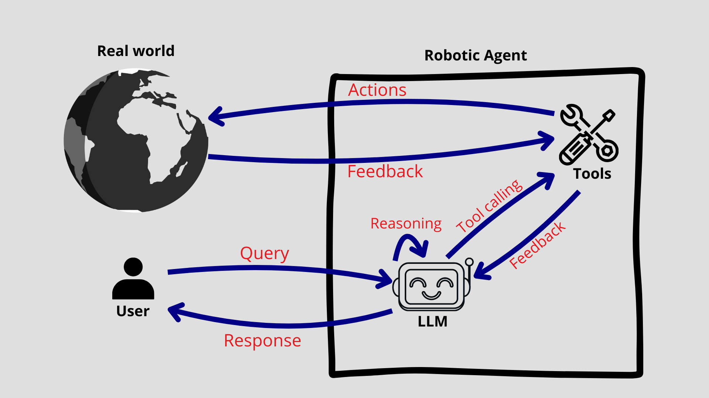

# Robot Agent

The `robot_agent` implements a natural language interface acting as a bridge for more intuitive Human-Robot interactions. In fact the `robot agent` leverages the reasoning capabilities of Large Language Models (LLMs) to allow a human user to send commands/inquiries to a robot without the need to master technical robotic skills. Only the ability to speak/write natural language is required during the interaction with robots. For example, during an interaction, a user might say _takeoff the drone_, and our robot agent will verify whether the action is possible (for example, the robot agent will check if the robot is indeed a drone and has enough battery level to takeoff), then it will call the _takeoff_ tool responsible for handling the low level logic required for the drone to actually start flying.

---

## How does it work?

This package is built upon [ROSA](https://github.com/nasa-jpl/rosa), a flexible AI-based robot assistant, allowing to develop custom agents for specific robots. The agents are actually Large Language Models (such as ChatGPT, Llama...) equipped with a set of tools for carrying specific actions.

### What is a tool?

Tools are functions defined to perform a specific task. They can be "called" by an LLM, allowing the LLM to actually perform actions in the real world. This mechanism often refered to as "**Tool calling**".  
For example, if we want an LLM to make a robot move based on the user's query, we can implement a _move_ tool, that can be a python function that sends move commands to the robot driver depending on a parameter indicating the direction of the movement. During tool calling, the LLM will understand the in which direction the user wants to move the robot and call the _move_ tool with the appropriate argument.



The interaction flow is as on the figure above:

1.  A user enters a query (can be a question asked to the LLM, or the request to perform an action),
1.  The LLM reasons about the query and decide which tool is the most appropriate to use.
1.  If a some tool is a good candidate, the LLM will use that tool (with required parameters when applicable)
1.  The tool (which can be a python function) performs some actions based on its arguments. The action can be fetching some data, or sending a request to an API to perform some action.
1.  Upon completion of the action or in case of an error, the tool returns a feedback to the LLM.
1.  The LLM uses that feedback to provide a response to the user's query.

### Structure of the package

The structure of the `robot_agent` package is as follows:


**llm_agent.py**

This is the central agent coordinates the robot controllers, allowing to add, delete different robot controllers.

**<robot_platform\>\_controller.py**

Each robot is assigned a `controller` (e.g. `Tello Controller` for the Tello drone). Each controller provides tools specific to the corresponding robot and handles lower level tasks such as ROS2 topics, services, communication with the plugins. This make the `robot_agent` more flexible because adding a new robot type reuqires only to define the controller of set of tool for that particular robot.

**voice_input_output.py**

For voice input and p

**text_input.py**

---

## What are the functionalities available?

**Tello**

| Tool name               | What it does                                                                                               | Example user input that should trigger this tool |
| ----------------------- | ---------------------------------------------------------------------------------------------------------- | ------------------------------------------------ |
| `move`                  | Moves the drone in 3D space and/or rotates it while it is in the air.                                      | “Fly forward for 2 seconds”                      |
| `takeoff`               | Commands the drone to take off from the ground if battery and state conditions allow.                      | “Take off”                                       |
| `land`                  | Lands the drone.                                                                                           | “Land now”                                       |
| `flip`                  | Commands the drone to perform an aerial flip in a specified direction.                                     | “Do a forward flip”                              |
| `get_battery_level`     | Returns the current battery percentage of the drone.                                                       | “What’s the battery level of the drone?”         |
| `status_drone`          | Returns the drone’s current state, (e.g. battery, Wi-Fi strength, etc).                                    | “What’s the status of the drone ?”               |
| `switch_mode`           | Switches the drone’s control mode to a specified mode (e.g. keyboard, hand control, or object tracking).   | “Switch to keyboard mode”                        |
| `start_object_tracking` | Starts tracking a person holding a specified object. The type of objects that can be specified is limited. | “Follow the person with a backpack”              |
| `stop_object_tracking`  | Stops the current object tracking task.                                                                    | “Stop tracking”                                  |
| `throw_and_go`          | Initiates a throw takeoff where the drone begins flying after being physically thrown.                     | “Do a throw takeoff”                             |
| `palm_land`             | Lands the drone gently onto an open palm detected beneath it.                                              | “Land on my palm"                                |

**Spot**

| Tool name                   | What it does                                                                                          | Example user input that should trigger this tool |
| --------------------------- | ----------------------------------------------------------------------------------------------------- | ------------------------------------------------ |
| `get_general_status`        | Returns a high-level overview of the robot’s current state (e.g. battery, Wi-Fi, tracking status...). | “What’s the robot’s status?”                     |
| `get_battery_status`        | Provides detailed battery diagnostics of the robot.                                                   | “Show detailed battery information”              |
| `get_wifi_connection_state` | Returns the robot’s current Wi-Fi mode and connected network, if any.                                 | “Is the robot connected to Wi-Fi?”               |
| `get_mobility_metrics`      | Reports mobility statistics such as distance traveled and movement time.                              | “How far has the robot walked?”                  |
| `stand`                     | Commands the robot to stand up from a sitting position if battery conditions allow.                   | “Stand up”                                       |
| `sit`                       | Commands the robot to sit down from a standing position.                                              | “Sit down”                                       |
| `move`                      | Moves the robot using linear and/or angular velocity commands for a specified or default duration.    | “Walk forward for 2 seconds”                     |
| `switch_mode`               | Switches the robot’s control mode such as keyboard, hand control, or object tracking.                 | “Switch to hand control mode”                    |
| `start_object_tracking`     | Starts tracking a person holding a specified object from a predefined list.                           | “Follow the person holding a laptop”             |
| `stop_object_tracking`      | Stops the current object tracking task and clears the tracking target.                                | “Stop tracking”                                  |

**Query Input**
To input query, one can use

- Text
- Voice

**Response output**  
The response output is done by

- printing the textual response on the terminal
- TTS of the text.

---

## Launch the robot agent package

Before launching the `robot_agent`, make sure that your ROS2 workspace and (virtual environment if applicable) are properly sourced.
In case of any doubts, please refer to [Launch guide](../GettingStarted/launch_guide.md).

<!--Explain that you should only launch a robot if all dependencies are available (llm agent dependencies)-->

To run the `robot_agent` package, use

```bash
ros2 run robot_agent robot_agent_node
```

---

## Use case example

---

## Adding a robot
