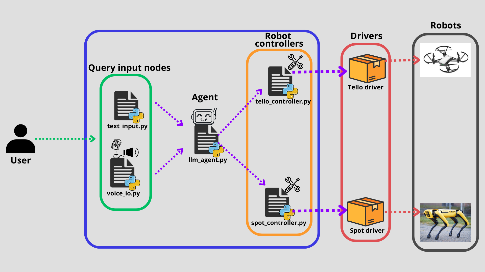

# Robot Agent

The `robot_agent` implements a natural language interface acting as a bridge for more intuitive Human-Robot interactions. In fact the `robot agent` leverages the reasoning capabilities of LLMs to allows a human user to send commands/inquiries to a robot without the need to master technical robotic skills. Only the ability to speak/write natural language is required during the interaction with robots. For example, a user might say _takeoff the drone_, and our robot agent will verify whether the action is possible (for example, the robot agent will check whether the robot is indeed a drone and has enough battery level to takeoff), then it will call the _takeoff_ tool responsible for handling the low level logic required for the drone to actually start flying.

## How does it work?

This package is built upon [ROSA](https://github.com/nasa-jpl/rosa), a flexible AI-based robot assistant, allowing to develop custom agents for specific robots.

**What is a tool?**

**Structure of the package**
The structure of the `robot_agent` package is as follows:

**<robot_platform>\_controller.py**
Each robot is assigned a `controller` (e.g. `Tello Controller` for the Tello drone). Each controller provides tools specific to the corresponding robot and handles lower level tasks such as ROS2 topics, services, communication with the plugins. This make the `robot_agent` more flexible because adding a new robot type reuqires only to define the controller of set of tool for that particular robot.

**llm_agent.py**  
This is the central agent coordinates the robot controllers, allowing to add, delete different robot controllers.

**voice_input_output.py**
For voice input and p

**text_input.py**

---

## What are the functionalities available?

**Tello**
**Spot**
**Query Input**
**Response output**

---

## Launch the robot agent package

Before launching the `robot_agent`, make sure that your ROS2 workspace and (virtual environment if applicable) are properly sourced.
In case of any doubts, please refer to [Launch guide](../GettingStarted/launch_guide.md).

---

## Use case example

---

## Adding a robot
