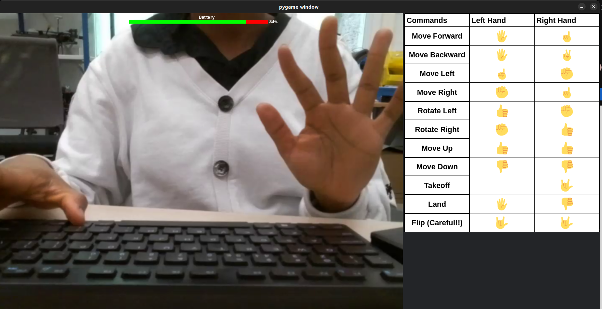
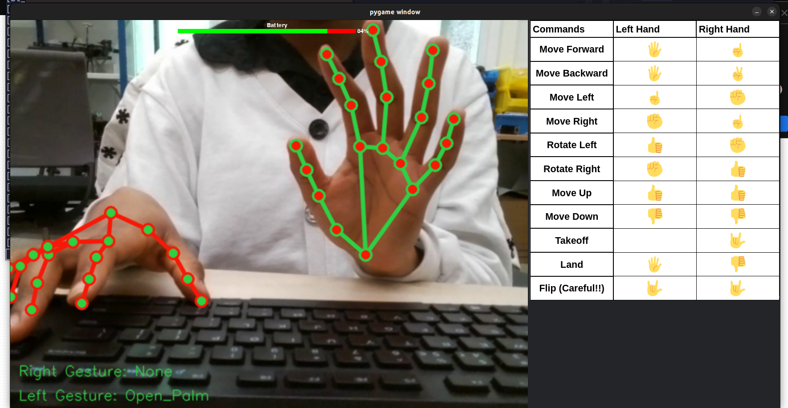

# Tello Control Station

!!! warning

    This is a legacy package that will be replaced by possibly a web application.
    It is a UI package running with pygame. It is very limited and not well designed.

Primarily built for the Tello drone, the `Tello Control Station` is a ROS2 package for visualizing image frames comming from the robot's camera.

Based on Pygame, the `Tello Control Station` also allows to move the robot using the keyboard or a joystick. It is meant for being used along with the `hand gesture plugin` of the `robot_suite`.

!!! Danger "Important"

    For the Control Station to work well with a robot, you need to ensure that ROS2 topic names are compatible.

---

## Control modes

1.  **Keyboard control mode**

    This mode allows you to change the control to another mode using your keyboard. It is also possible to control the robot using the keyboard when in this mode.  
    Here is a summary table of the actions possible:

    | Key | Action || Key | Action |
    | ------------- | ------------------------------- || ------------ | ----------- |
    | `j` | Switch to joystick control mode || `q` | Quit |
    | `k` | Switch to keyboard control mode || `e` | Emergency |
    | `h` | Swtich to hand control mode || `w` | Go forward |
    | `f` | Switch to face control mode || `s` | Go backward |
    | `m` | Switch to manual control mode || `a` | Go left |
    | `t` | Take-off || `d` | Go right |
    | `l` | Land || `up arrow` | Go up |
    | `down arrow` | Go down || `left arrow` | Turn left |
    | `right arrow` | Turn right |

1.  **Joystick control mode**

    As its name implies, the joystick mode allows to control the robot using a joystick.

    Here is a table summarizing the actions possible to perform using a Logitech F710 Gamepad:

    | Button | Direction | Action ||Button | Action|
    | -------------- | --------- | ------------------------------- || ----- | ----- |
    | `Right analog` | Right | Go right ||`A` | Switch to hand control mode |  
    | | Left | Go left ||`B` | Switch to face control mode |
    | | Up | Go forward || `X` | Switch to keyboard control mode |
    | | Down | Go backward || `LB` | Emergency |
    | `Left analog` | Right | Turn right ||`RB` | Quit |
    | | Left | Turn left || `Back` | Land |
    | | Up | Go up ||`Start` | Take-off |
    | | Down | Go down |

    !!! Note

        The inputs may change if you use a different joystick.

1.  **Hand control mode**

    This mode allows you to control the robot using hand gestures.

    The hand gestures recognition part is managed by the [hand gesture plugin](../Plugins/hand_gestures.md), and the `Tello control Station` allows you to visualize the gestures as they are detected.

    For more information on how to control the robot using hand gestures, please check [the hand gesture plugin page](../Plugins/hand_gestures.md).

!!! Tip

    - When using the `Tello control Station`, always click on the GUI window before entering a keyboard command, otherwise, the command won't be executed.
    - Switching between control mode is done by pressing specific keys on the keyboard:
        * **`k`** for keyboard control mode
        * **`j`** for joystick control mode
        * **`h`** for hand control mode

---

## Image visualization

The `Tello Control Station` allows to visualize either raw video frames (coming directly from the driver), or gesture-annotated frames (image frames on which hand gesture recognition was performed).

- **Raw images**

    When in any control mode different from **hand control mode**, raw images are displayed on the GUI window. These are unprocessed frames coming from the robot's camera.

    The screenshot below shows the `Tello Control Station` in keyboard mode, operating on a Tello drone.

    

- **Gesture-annotated images**

    In **hand control mode**, the GUI windows displays images on which detected hand gestures are annotated.
    For instance, the screenshot below show the `Tello control Station` in hand control mode, with hand gestures being detected. The robot used here is a Tello drone.

    
