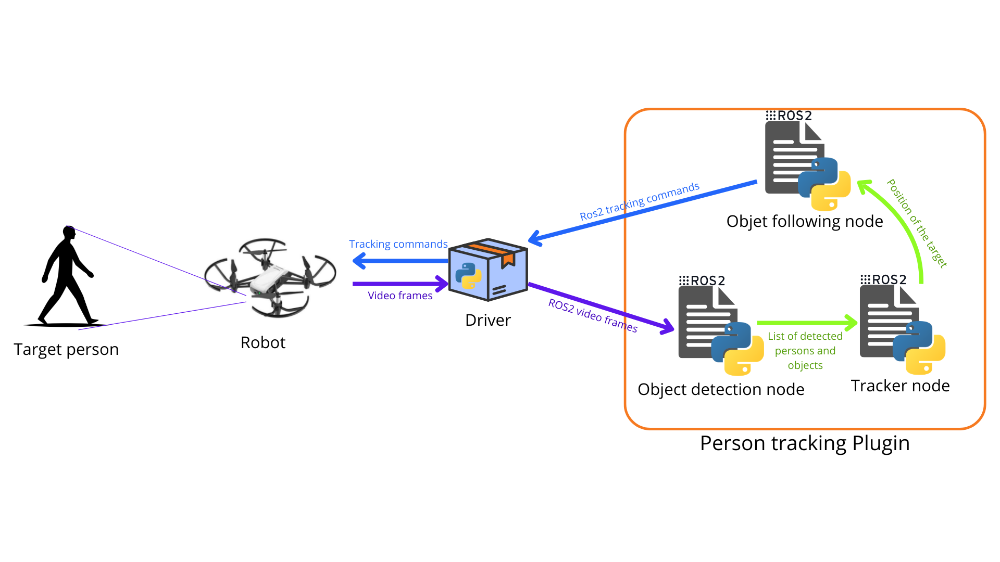

# Person Tracking Plugin

This plugin allows the robot to follow a specific person.
It uses deep learning based object detection and tracking to identify objects and follow them throughout video frames.
We now use the information given by the deep learning object tracking model to send appropriate commands that will make the robot follow the target in real life.

---

## Plugin structure

**Object detection**

As the name indicates, this part of the plugin handles real time object detection. Given real time video frames coming form the robot's driver, this nodes performs object detection on the frames, and publishes the list of bounding boxes on a new topic. It also publishes image frames on which the bounding boxes around objects are outlined, for visualization purposes.

**Object following**

This is the part responsible for actually tracking a specific person.

1. The `tracker node` is responsible for selecting the target person to follow, and updating its current position (relative to the robot's camera).
   Based on the list of bounding boxes sent by the `object detection node`, and depending on the target selection mode, the `tracker node` chooses the person that the robot should follow, updates his/her position as she/he moves and sends the latest position to the `object following node` to compute tracking commands.  
   At the moment, there are two selection modes possible:
    - Via hand gestures  
      In this mode, the person to follow is selected via hand gestures. The recognition of gestures relies on the [hand gestures plugin](../Plugins/hand_gestures.md). And there is an additional node, the `sign filter` which purpose is to to send a tracking signal to the `Tracker node` when someone does a specific gesture (requesting for tracking).
    - Via the robot agent  
      It is possible to ask the [robot agent](../Packages/robot_agent.md) to track a specific person (based on an object they hold). In this case, the `robot agent` will use a tool to find a person matching the description of the user. If such a person is found, the `robot_agent` will send a tracking signal to the `Tracker node`, specifying the position of the person to follow.

1. The `Object following node` is responsible for computing appropriate commands that will allow the robot to follow the target in the real world. Based on the position of the target, this node relies on controls methods (such as MPC) to compute which commands the drone should execute to follow the target.

**Helper nodes**

1. _Sign filter_ : This node is responsible for listening to recognized hand gestures, to find if someone did the specific gesture for requesting tracking. If that's the case, a signal to start the tracking is sent to the tracker node, specifying which person is the target.
1. _Person object associator_ : The aim of this node is to provide a mapping of persons detected to objects they have on them. It uses the list of detected objects obtained from `object_detection_node` to build that mapping. For example, if someone holds a bottle, the object detection will detect both the person and the bottle, and provide the coordinates of the bounding boxes around both. These bounding boxes can then be used to determine that the person holds the bottle.
1. _Drawing node_ : This node was implemented solely to be able to visualize the current target of the tracking.

---

## ROS2

### ROS2 custom messages

- AllBoundingBoxes
- Box
- PointMsg

### Object detection node

**Topics and services**

| Topic Name             | Direction  | Message Type                                | Main Purpose                                                                                                      |
| ---------------------- | ---------- | ------------------------------------------- | ----------------------------------------------------------------------------------------------------------------- |
| `/camera/image_raw`    | Subscribed | `sensor_msgs/msg/Image`                     | Receives raw RGB camera frames for object detection processing.                                                   |
| `/camera/all_detected` | Published  | `sensor_msgs/msg/Image`                     | Publishes annotated images with detected persons and selected objects drawn on the frame.                         |
| `/all_bounding_boxes`  | Published  | `person_tracking_msgs/msg/AllBoundingBoxes` | Publishes a list of bounding boxes (class, ID, normalized coordinates) for detected persons and selected objects. |

**Parameters**

| Parameter Name         | Type       | Default Value                                                                                      | Purpose                                                                                                  |
| ---------------------- | ---------- | -------------------------------------------------------------------------------------------------- | -------------------------------------------------------------------------------------------------------- |
| `image_raw_topic`      | `string`   | `/camera/image_raw`                                                                                | Topic name from which raw camera frames are subscribed.                                                  |
| `all_detected_topic`   | `string`   | `/camera/all_detected`                                                                             | Topic name on which annotated detection frames are published.                                            |
| `bounding_boxes_topic` | `string`   | `/all_bounding_boxes`                                                                              | Topic name on which detected bounding boxes are published.                                               |
| `model_type`           | `string`   | `yolo`                                                                                             | Defines the object detection framework type to initialize.                                               |
| `model_name`           | `string`   | `yolo11n.pt`                                                                                       | Specifies the YOLO model file used for inference.                                                        |
| `person_classes`       | `string[]` | `["person"]`                                                                                       | List of person-related class names to detect.                                                            |
| `objects`              | `string[]` | `["cell phone", "backpack", "book", "laptop", "handbag", "bottle", "umbrella", "banana", "apple"]` | List of additional object classes to detect and track.                                                   |
| `minimum_prob`         | `double`   | `0.4`                                                                                              | Minimum confidence threshold required for a detection to be accepted.                                    |
| `process_interval`     | `double`   | `10e7`                                                                                             | Minimum time interval (nanoseconds) between consecutive detection executions to reduce computation load. |

### Person object association

**Topics and services**

| Topic Name            | Direction  | Message Type                                | Main Purpose                                                                                                                            |
| --------------------- | ---------- | ------------------------------------------- | --------------------------------------------------------------------------------------------------------------------------------------- |
| `/all_bounding_boxes` | Subscribed | `person_tracking_msgs/msg/AllBoundingBoxes` | Receives detected persons and objects bounding boxes for association processing.                                                        |
| `/tracking_info`      | Published  | `std_msgs/msg/String`                       | Publishes JSON-formatted tracking information describing persons and the objects associated with them (for LLM command interpretation). |

**Parameters**

| Parameter Name         | Type     | Default Value         | Purpose                                                                                         |
| ---------------------- | -------- | --------------------- | ----------------------------------------------------------------------------------------------- |
| `bounding_boxes_topic` | `string` | `/all_bounding_boxes` | Topic name from which bounding boxes are subscribed.                                            |
| `tracking_info_topic`  | `string` | `/tracking_info`      | Topic name on which JSON tracking information is published.                                     |
| `overlapping_method`   | `string` | `intersection`        | Method used to determine association between objects and persons based on bounding box overlap. |

### Tracker node

**Topics and services**

| Topic Name                 | Direction  | Message Type                                | Main Purpose                                                                                       |
| -------------------------- | ---------- | ------------------------------------------- | -------------------------------------------------------------------------------------------------- |
| `/all_bounding_boxes`      | Subscribed | `person_tracking_msgs/msg/AllBoundingBoxes` | Receives all detected persons and objects bounding boxes for pilot selection and tracking updates. |
| `/tracking_signal_llm`     | Subscribed | `std_msgs/msg/String`                       | Receives JSON tracking commands from the LLM module (start/stop tracking with bounding box info).  |
| `/tracking_signal_gesture` | Subscribed | `std_msgs/msg/String`                       | Receives JSON tracking commands triggered by hand gesture recognition.                             |
| `/person_tracked`          | Published  | `person_tracking_msgs/msg/Box`              | Publishes the bounding box of the currently tracked person (pilot).                                |
| `/tracking_status`         | Published  | `std_msgs/msg/Bool`                         | Publishes whether tracking is currently active (`true`) or not (`false`).                          |

| Service Name         | Type                                    | Direction | Main Purpose                                                                |
| -------------------- | --------------------------------------- | --------- | --------------------------------------------------------------------------- |
| `/tracking_mode_srv` | `person_tracking_msgs/srv/TrackingMode` | Server    | Allows external nodes to switch tracking mode between `"llm"` and `"hand"`. |

**Parameters**

| Parameter Name               | Type      | Default Value              | Purpose                                                                        |
| ---------------------------- | --------- | -------------------------- | ------------------------------------------------------------------------------ |
| `pilot_topic`                | `string`  | `/person_tracked`          | Topic name where the tracked person’s bounding box is published.               |
| `bounding_boxes_topic`       | `string`  | `/all_bounding_boxes`      | Topic name from which detected bounding boxes are received.                    |
| `llm_tracking_signal_topic`  | `string`  | `/tracking_signal_llm`     | Topic name for LLM-based tracking control signals.                             |
| `hand_tracking_signal_topic` | `string`  | `/tracking_signal_gesture` | Topic name for gesture-based tracking control signals.                         |
| `tracking_status_topic`      | `string`  | `/tracking_status`         | Topic name used to publish the current tracking state.                         |
| `tracking_mode`              | `string`  | `hand`                     | Defines the active tracking control source (`"llm"` or `"hand"`).              |
| `tracking_mode_srv`          | `string`  | `/tracking_mode_srv`       | Service name used to change tracking mode at runtime.                          |
| `max_no_update_before_lost`  | `integer` | `30`                       | Number of consecutive non-updates before declaring the tracked person as lost. |
| `overlapping_method`         | `string`  | `intersection`             | Method used to compute bounding box overlap when matching persons.             |

### Following node

**Topics and services**

| Topic Name            | Direction  | Message Type                                | Main Purpose                                                                           |
| --------------------- | ---------- | ------------------------------------------- | -------------------------------------------------------------------------------------- |
| `/person_tracked`     | Subscribed | `person_tracking_msgs/msg/Box`              | Receives the bounding box of the currently tracked person to compute control commands. |
| `/tracking_status`    | Subscribed | `std_msgs/msg/Bool`                         | Receives whether tracking is active to enable or disable command publishing.           |
| `/all_bounding_boxes` | Subscribed | `person_tracking_msgs/msg/AllBoundingBoxes` | Receives all detected bounding boxes to enable optional collision avoidance behavior.  |
| `/cmd_vel`            | Published  | `geometry_msgs/msg/Twist`                   | Publishes velocity commands to move the drone in order to follow the tracked person.   |

**Parameters**

| Parameter Name             | Type     | Default Value         | Purpose                                                                       |
| -------------------------- | -------- | --------------------- | ----------------------------------------------------------------------------- |
| `person_tracked_topic`     | `string` | `/person_tracked`     | Topic from which the tracked person's bounding box is received.               |
| `commands_topic`           | `string` | `/cmd_vel`            | Topic on which velocity commands are published.                               |
| `tracking_status_topic`    | `string` | `/tracking_status`    | Topic used to receive the current tracking activation status.                 |
| `all_bounding_boxes_topic` | `string` | `/all_bounding_boxes` | Topic used to receive all bounding boxes for obstacle avoidance logic.        |
| `control_method`           | `string` | `MPC`                 | Control strategy used for following behavior (`"on/off"`, `"P"`, or `"MPC"`). |

### Sign filter node

**Topics and services**

| Topic Name                   | Direction  | Message Type                       | Main Purpose                                                                                                     |
| ---------------------------- | ---------- | ---------------------------------- | ---------------------------------------------------------------------------------------------------------------- |
| `/person_tracked`            | Subscribed | `person_tracking_msgs/msg/Box`     | Receives the bounding box of the currently tracked person to identify whether gestures originate from the pilot. |
| `/hand/landmarks`            | Subscribed | `hand_gestures_msgs/msg/Landmarks` | Receives detected hand landmarks and gesture classifications from the vision system.                             |
| `/tracking_status`           | Subscribed | `std_msgs/msg/Bool`                | Receives whether tracking is currently active to adapt gesture filtering logic.                                  |
| `/hand/landmarks_from_pilot` | Published  | `hand_gestures_msgs/msg/Landmarks` | Publishes filtered landmarks corresponding only to the pilot or valid gesture scenarios.                         |
| `/tracking_signal_gesture`   | Published  | `std_msgs/msg/String`              | Publishes JSON-encoded gesture events used to trigger or stop tracking.                                          |

**Parameters**

| Parameter Name               | Type     | Default Value                | Purpose                                                            |
| ---------------------------- | -------- | ---------------------------- | ------------------------------------------------------------------ |
| `person_tracked_topic`       | `string` | `/person_tracked`            | Topic used to receive the tracked person's bounding box.           |
| `landmarks_topic`            | `string` | `/hand/landmarks`            | Topic used to receive raw detected hand landmarks.                 |
| `landmarks_from_pilot_topic` | `string` | `/hand/landmarks_from_pilot` | Topic where filtered landmarks (pilot-only) are published.         |
| `hand_tracking_signal_topic` | `string` | `/tracking_signal_gesture`   | Topic used to publish gesture-based tracking trigger/stop signals. |
| `tracking_status_topic`      | `string` | `/tracking_status`           | Topic used to receive current tracking state.                      |
| `right_hand_gesture_trigger` | `string` | `Open_Palm`                  | Gesture required from the right hand to trigger tracking start.    |
| `left_hand_gesture_trigger`  | `string` | `Open_Palm`                  | Gesture required from the left hand to trigger tracking start.     |
| `right_hand_gesture_stop`    | `string` | `Closed_Fist`                | Gesture required from the right hand to trigger tracking stop.     |
| `left_hand_gesture_stop`     | `string` | `Closed_Fist`                | Gesture required from the left hand to trigger tracking stop.      |

### Drawer node

**Topics and services**

| Topic Name                     | Direction  | Message Type                   | Main Purpose                                                                       |
| ------------------------------ | ---------- | ------------------------------ | ---------------------------------------------------------------------------------- |
| `/camera/image_raw`            | Subscribed | `sensor_msgs/msg/Image`        | Receives raw RGB frames from the camera to be used as drawing background.          |
| `/person_tracked`              | Subscribed | `person_tracking_msgs/msg/Box` | Receives the bounding box of the tracked person to overlay annotations.            |
| `/hand/annotated/image`        | Subscribed | `sensor_msgs/msg/Image`        | Receives camera frames already annotated with hand landmarks.                      |
| `/tracking_status`             | Subscribed | `std_msgs/msg/Bool`            | Receives the tracking state to decide whether to draw the target bounding box.     |
| `/camera/person_tracked`       | Published  | `sensor_msgs/msg/Image`        | Publishes camera frames with the tracked person highlighted.                       |
| `/camera/hands/person_tracked` | Published  | `sensor_msgs/msg/Image`        | Publishes frames where both the tracked person and hand annotations are displayed. |

**Parameters**

| Parameter Name                           | Type     | Default Value                  | Purpose                                                                     |
| ---------------------------------------- | -------- | ------------------------------ | --------------------------------------------------------------------------- |
| `image_raw_topic`                        | `string` | `/camera/image_raw`            | Topic used to receive raw camera images.                                    |
| `person_tracked_topic`                   | `string` | `/person_tracked`              | Topic used to receive the tracked person’s bounding box.                    |
| `drawing_person_tracked_topic`           | `string` | `/camera/person_tracked`       | Output topic for images where only the tracked person is highlighted.       |
| `image_annotated_hands_topic`            | `string` | `/hand/annotated/image`        | Topic used to receive images already annotated with hand landmarks.         |
| `drawing_person_tracked_and_hands_topic` | `string` | `/camera/hands/person_tracked` | Output topic for images showing both tracked person and hand landmarks.     |
| `tracking_status_topic`                  | `string` | `/tracking_status`             | Topic used to receive current tracking state.                               |
| `publishing_rate`                        | `double` | `0.03`                         | Timer period (seconds) controlling the image publishing frequency (~30 Hz). |

---

## Launching in standalone mode
